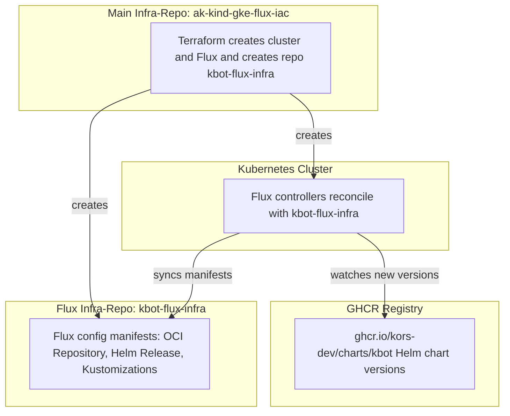

# 📘 Flux + Helm Automation Project

## 🎯 Purpose
Automated deployment of applications in a Kubernetes cluster using **FluxCD** and **Helm**, where new versions of Helm charts are automatically pulled from an OCI registry (GitHub Container Registry).

---

## 🏗️ Infrastructure Repositories

This project works with **two levels of repositories**:

1. **Main infra-repo** (e.g., `ak-kind-gke-flux-iac`)  
   - Managed by Terraform (OpenTofu).  
   - Its responsibilities:  
     - Create the Kubernetes cluster (KIND or GKE).  
     - Generate an SSH key.  
     - Create a **separate GitHub repository** for Flux (`kbot-flux-infra`).  
     - Bootstrap Flux in the cluster and configure it to sync with the new repo.  

   > **Note:** This repository only describes infrastructure (cluster + Flux bootstrap). It does **not** contain application manifests.

2. **Flux infra-repo** (automatically created, e.g., `kbot-flux-infra`)  
   - This is the repository that Flux in the cluster actually watches (`GitRepository name=flux-system`).  
   - It stores all GitOps-level manifests:  
     - `OCIRepository` → defines Helm chart source in GHCR.  
     - `HelmRelease` → defines how and where to deploy the chart.  
     - `Kustomization` → tells Flux what to apply in the cluster.  

   > This repo is created automatically and **should not be edited manually**.  
   All changes must go through automation (Terraform/Flux). If you edit it directly, your changes will eventually be overwritten.

---

## 🔄 Workflow

1. Developer pushes code/chart to `kors-dev/kbot`.  
2. The Helm chart is published into OCI registry (`ghcr.io/.../charts/kbot`).  
3. In `kbot-flux-infra`, resources are defined:  
   - `OCIRepository` → watches GHCR.  
   - `HelmRelease` → deploys the chart.  
4. Flux in the cluster pulls manifests from **`kbot-flux-infra`**, detects the new chart version, and performs `helm upgrade`.  
5. The main `ak-kind-gke-flux-iac` repo is **not involved anymore** — it only bootstrapped the cluster and created `kbot-flux-infra` at the beginning.

---

## 📊 Flow Chart



# ak-kind-gke-flux-iac

Infrastructure-as-code to spin up a **local KIND dev cluster** and a **GKE cluster**, then **bootstrap Flux** and continuously deliver your app(s) from a separate GitOps repo. Everything is driven by **OpenTofu** (Terraform-compatible).

> Straight talk: run a few make targets, provide your tokens once, and you’ll have Flux reconciling manifests that are synced automatically from this repo into your GitOps repo.

---

## What this repo does

- Creates a **KIND** cluster for fast local testing.
- Creates a **GKE** cluster (VPC-native) with a node pool.
- **Bootstraps Flux** in each cluster:
  - KIND uses path `flux/clusters/kind`.
  - GKE uses path `flux/clusters/gke`.
- **Syncs the local `flux/` tree** into a separate GitOps repo (default: `kbot-flux-infra`) using the GitHub API.
- Deploys a sample app (`kbot`) via **OCIRepository + HelmRelease** (chart in GHCR) and keeps it up-to-date.

---

## Repo layout (important bits)

```
.
.
├── Makefile
├── README.md
├── flux
│   ├── apps
│   │   └── kbot
│   │       ├── helmrelease.yaml
│   │       └── oci-repo.yaml
│   ├── clusters
│   │   ├── gke
│   │   │   └── apps-kustomization.yaml
│   │   └── kind
│   │       └── apps-kustomization.yaml
├── gke
│   └── terraform
│       ├── backend.tf
│       ├── flux-bootstrap.tf
│       ├── gke-cluster.tf
│       ├── gke-network.tf
│       ├── gke-nodepool.tf
│       ├── outputs.tf
│       ├── providers.tf
│       ├── sync.tf
│       ├── terraform.tfstate
│       ├── terraform.tfstate.backup
│       ├── terraform.tfvars
│       └── variables.tf
├── key.json
└── kind
    └── terraform
        ├── kind-cluster-config
        ├── main.tf
        ├── outputs.tf
        ├── sync.tf
        ├── terraform.tfstate
        ├── terraform.tfstate.backup
        ├── terraform.tfvars
        └── variables.tf
```

KIND and GKE **share the same GitOps repo** (e.g. `kbot-flux-infra`), but reconcile **different cluster paths**.

---

## Prerequisites

- **OpenTofu** CLI (`tofu`)
- **kubectl**
- **Docker** (KIND needs it)
- **kind** (for local cluster)
- **gcloud** CLI (for GKE)
- A **GitHub Personal Access Token** (PAT)
  - Scopes: `repo` (or `public_repo` if your GitOps repo is public).
  - Export it for both GitHub provider and Flux provider (HTTPS):
    ```bash
    export GITHUB_TOKEN='<your_pat>'
    export TF_VAR_github_token="$GITHUB_TOKEN"
    ```
- For GKE: Google Cloud auth as **Application Default Credentials (ADC)**:
  ```bash
  export USE_GKE_GCLOUD_AUTH_PLUGIN=True
  gcloud auth application-default login --no-launch-browser
  gcloud auth application-default set-quota-project <YOUR_GCP_PROJECT_ID>
  gcloud config set project <YOUR_GCP_PROJECT_ID>
  gcloud config set compute/region europe-central2
  ```

---

## Quick start — KIND (local dev)

From repo root:

```bash
make kind-init
make kind-plan
make kind-apply
```

This will:
- Create a KIND cluster.
- Bootstrap Flux (path: `flux/clusters/kind`).
- Create (or reuse) the GitOps repo and **sync** the local `flux/` content into it.

Check it:

```bash
kubectl get nodes
kubectl -n flux-system get pods
kubectl -n flux-system get gitrepositories,kustomizations,ocirepositories
kubectl -n default get helmreleases
kubectl -n default get pods | grep kbot
```

If your app needs a secret (example: Telegram token):

```bash
kubectl -n default create secret generic kbot   --from-literal=TELE_TOKEN='<your_telegram_bot_token>'
```

Destroy:

```bash
make kind-destroy
```

---

## Quick start — GKE

1) **Prepare variables** in `gke/terraform/terraform.tfvars` (or `vars.tfvars`):

```hcl
project_id   = "YOUR_GCP_PROJECT_ID"
region       = "europe-central2"
zone         = "europe-central2-a"
name         = "ak-gke"
node_count   = 1
machine_type = "e2-standard-2"

github_owner = "kors-dev"
flux_repo    = "kbot-flux-infra"
flux_branch  = "main"
# Do NOT put github_token here; pass via env:
# export TF_VAR_github_token="$GITHUB_TOKEN"
```

2) **Authenticate gcloud / ADC** (see “Prerequisites”).

3) **Run**:

```bash
export TF_VAR_github_token="$GITHUB_TOKEN"

make gke-init
make gke-plan
make gke-apply
make gke-kubeconfig     # fetch kubeconfig into kubectl
```

4) **Create app secret** (if needed):

```bash
kubectl -n default create secret generic kbot   --from-literal=TELE_TOKEN='<your_telegram_bot_token>'
```

5) **Verify**:

```bash
kubectl -n flux-system get pods
kubectl -n flux-system get gitrepositories,kustomizations,ocirepositories
kubectl -n default get helmreleases
kubectl -n default get pods | grep kbot
```

Destroy:

```bash
make gke-destroy
```

---

## GitOps flow (what happens next)

- Local `flux/` manifests are **auto-committed** into the GitOps repo by `github_repository_file` resources (`sync.tf` in each stack).
- Flux watches:
  - `GitRepository/flux-system` → pulls your GitOps repo.
  - `Kustomization/apps` → applies `./flux/apps` (shared across clusters).
  - `OCIRepository/app-kbot` → tracks chart in GHCR (semver constraint).
  - `HelmRelease/app-kbot` → deploys/updates your app.

When you push changes to your app that produce a new chart version (satisfying the semver in `oci-repo.yaml`), Flux picks it up and rolls it out automatically.

---

## Remote state (GCS) — **GKE only** (optional but recommended)

Create the bucket once:

```bash
PROJECT=<YOUR_GCP_PROJECT_ID>
BUCKET=ak-gke-flux-tfstate

gcloud config set project $PROJECT
gcloud storage buckets create gs://$BUCKET --location=EU --uniform-bucket-level-access
gcloud storage buckets update gs://$BUCKET --versioning
gcloud storage buckets update gs://$BUCKET --pap enforced
```

Add backend for GKE (`gke/terraform/backend.tf`):

```hcl
terraform {
  backend "gcs" {
    bucket = "ak-gke-flux-tfstate"
    prefix = "gke"
  }
}
```

Migrate local state:

```bash
tofu -chdir=gke/terraform init -upgrade -migrate-state
```

(Leave KIND on local state.)

---

## Make targets

- **KIND**
  - `make kind-init|kind-plan|kind-apply|kind-destroy`
  - `make kind-outputs`
  - `make kind-kubeconfig` (prints an export line)
  - `make kind-smoke` (quick node check)

- **GKE**
  - `make gke-init|gke-plan|gke-apply|gke-destroy`
  - `make gke-outputs`
  - `make gke-kubeconfig` (runs `gcloud container clusters get-credentials`)

> If you keep variables in `vars.tfvars`, ensure the Makefile passes `-var-file=vars.tfvars` within `-chdir=gke/terraform`. Otherwise, use `terraform.tfvars` to auto-load.

---

## Environment setup (summary)

```bash
# GitHub PAT for GitHub + Flux providers
export GITHUB_TOKEN='<your_pat>'
export TF_VAR_github_token="$GITHUB_TOKEN"

# gcloud ADC for Google provider and GKE auth plugin
export USE_GKE_GCLOUD_AUTH_PLUGIN=True
gcloud auth application-default login --no-launch-browser
gcloud auth application-default set-quota-project <YOUR_GCP_PROJECT_ID>
gcloud config set project <YOUR_GCP_PROJECT_ID>
gcloud config set compute/region europe-central2
```

Ensure **Docker** and **kind** are installed for the KIND stack.

---

## Troubleshooting

- **`No credentials loaded` (google provider)**  
  Run ADC login:
  ```bash
  gcloud auth application-default login --no-launch-browser
  gcloud auth application-default set-quota-project <YOUR_GCP_PROJECT_ID>
  ```

- **`vars.tfvars does not exist`**  
  With `-chdir=gke/terraform`, pass `-var-file=vars.tfvars` (no directory prefix), or rename to `terraform.tfvars` to auto-load.

- **Nothing copied into GitOps repo**  
  Ensure the `sync.tf` in the running stack points to the correct local flux path:
  - KIND stack: `../flux`
  - GKE stack: `../../flux`  
  Or set `var.flux_src_dir` explicitly.

- **Flux controllers running but app missing**  
  Check:
  ```bash
  kubectl -n flux-system get kustomizations
  kubectl -n flux-system get ocirepositories -o wide
  kubectl -n default get helmreleases -o wide
  ```
  Make sure `apps-kustomization.yaml` exists in the GitOps repo under the correct cluster path.

- **`CreateContainerConfigError` for app**  
  Likely a missing secret. Create it in the **right cluster/namespace**:
  ```bash
  kubectl -n default create secret generic kbot     --from-literal=TELE_TOKEN='<token>'
  ```

- **403 from GitHub on commit**  
  Your PAT is missing `repo` (or `public_repo`) scope, or the provider is misconfigured.

---

## Clean up

```bash
make kind-destroy
make gke-destroy
```

If you used a GCS backend for GKE:
```bash
gcloud storage rm -r gs://ak-gke-flux-tfstate   # only if you really want to delete state
```

---
